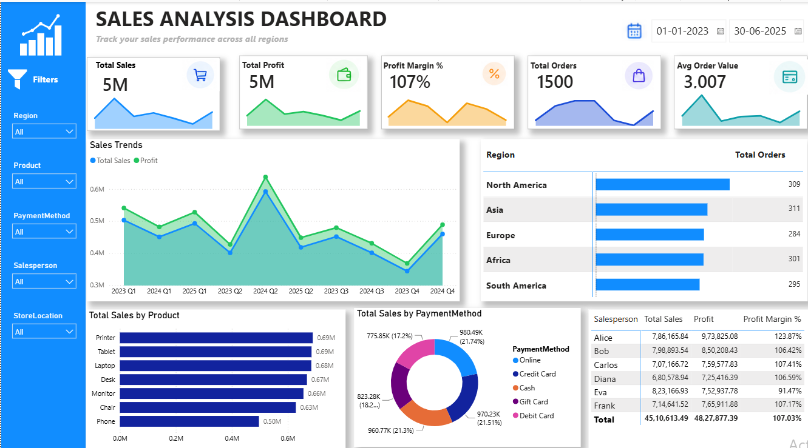

# 📊 Sales & Revenue Analysis — Power BI Dashboard

An interactive **Power BI dashboard** designed to analyze sales performance across regions, products, payment methods, and salespersons.

This project demonstrates practical skills in **data analysis, data visualization, Power BI, Power Query, and DAX**.



---

## 📌 Project Overview

The **Sales & Revenue Analysis Dashboard** transforms sales data into an interactive business intelligence report.

The dashboard provides a visual overview of:

* 💰 Total Sales
* 📦 Total Orders
* 🧾 Average Order Value
* 🔢 Total Quantity
* 🌍 Regional Sales
* 🛍️ Product Performance
* 💳 Payment Methods
* 👨‍💼 Salesperson Performance
* 📅 Sales Trends

Users can interact with the dashboard using filters and slicers to explore the data from different perspectives.

## 🛠️ Tools & Technologies

| Tool                   | Purpose                                      |
| ---------------------- | -------------------------------------------- |
| **Microsoft Power BI** | Dashboard development and data visualization |
| **Power Query**        | Data cleaning and transformation             |
| **DAX**                | KPI and measure calculations                 |
| **Microsoft Excel**    | Source data                                  |
| **GitHub**             | Project documentation and version control    |

---

## 🎯 Objectives

The main objectives of this project are:

* Analyze overall sales performance
* Compare sales across different regions
* Analyze product-wise sales
* Understand sales trends over time
* Compare payment methods
* Analyze salesperson performance
* Create interactive KPIs
* Present data through meaningful visualizations
* Practice Power BI and DAX concepts

## 📈 Dashboard Features

### 💰 Sales Overview

Provides a high-level summary of overall sales performance using KPI cards and visualizations.

### 🌍 Regional Analysis

Allows comparison of sales performance across different regions.

### 🛍️ Product Analysis

Shows the contribution of different products to overall sales.

### 📅 Sales Trend Analysis

Displays sales performance over time and helps identify changes in sales activity.

### 💳 Payment Method Analysis

Shows how sales are distributed across different payment methods.

### 👨‍💼 Salesperson Analysis

Provides a comparison of sales generated by different salespersons.

### 🎛️ Interactive Filters

The dashboard allows users to filter and explore the data based on available categories such as:

* Year
* Quarter
* Region
* Product
* Payment Method
* Salesperson

## 🧮 Key DAX Measures

### Total Sales

```DAX
Total Sales =
SUM(Sales[Total Sales])
```

### Total Orders

```DAX
Total Orders =
DISTINCTCOUNT(Sales[Order ID])
```

### Average Order Value

```DAX
Average Order Value =
DIVIDE(
    [Total Sales],
    [Total Orders],
    0
)
```

### Total Quantity

```DAX
Total Quantity =
SUM(Sales[Quantity])
```

---

## 🎓 Skills Demonstrated

Through this project, I practiced:

* Microsoft Power BI
* Power Query
* DAX
* Data Cleaning
* Data Transformation
* Data Visualization
* KPI Development
* Dashboard Design
* Business Intelligence
* Data Analysis

🔍 Project Purpose

This project was created as a learning and portfolio project to demonstrate practical experience with Power BI and data analysis.

The dashboard focuses on transforming raw sales data into an interactive and visually understandable report.

👩‍💻 Author

Renu Kumari

Computer Science Engineering Student

Interested in:

Software Development
Data Analytics
Business Intelligence
Data Visualization
Problem Solving

⭐ If you find this project interesting, feel free to explore the dashboard and give the repository a star!
